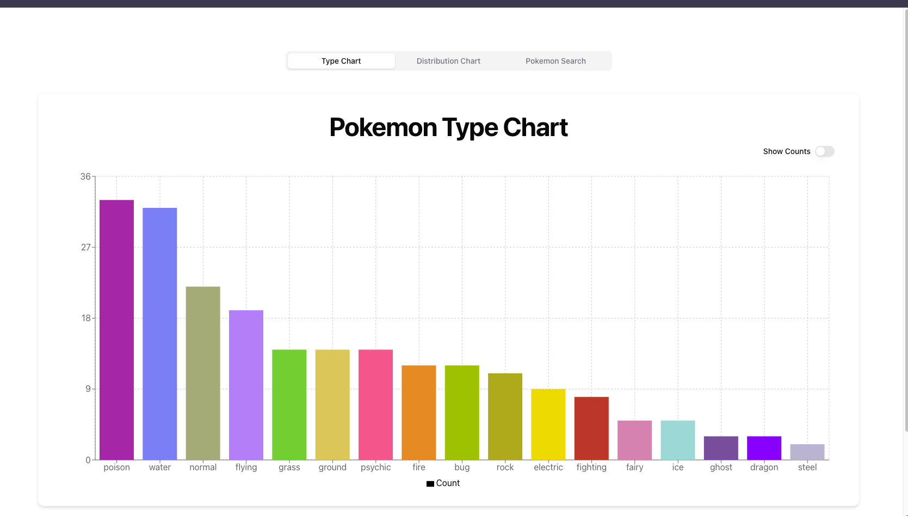

# Embeddable Pokemon

A simple interface for showing pokemon analytics using the Pokemon API and Recharts. 
[Click here to see deployed app](https://embeddable-pokemon.vercel.app/)


## Setting up
First install dependencies, then run the development server:

```bash
npm install && npm run dev
```

Open [http://localhost:3000](http://localhost:3000) with your browser to see the UI.

## User interface 


There are 3 tabs on the page that shows: 
1. A Type chart which is just a barchart that shows the counts of each pokemon type
2. A Distrubtion Chart which is a Pie Chart for showing the distribution of dual vs single type pokemons
3. A Pokemon Search that shows a list of all 151 pokemons and allows you to search through them as well. 


## Little challenges faced
There weren't so many challenges. One issue I had was when implemeting the percentage/count toggle. 
The BarChart component from Recharts wasn't updating the data based on the updated dataKey so I had to find an alternative. 